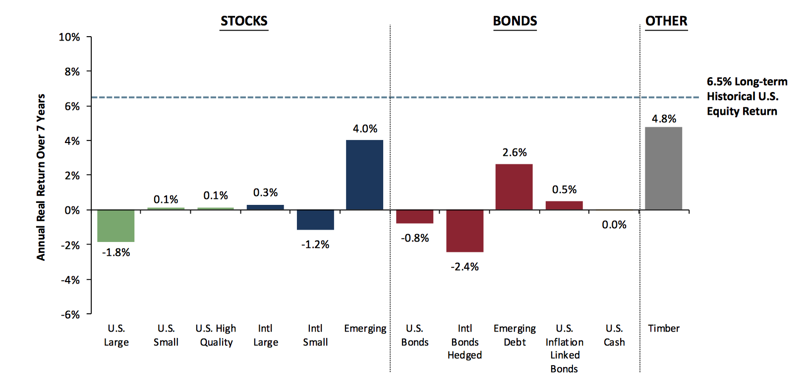
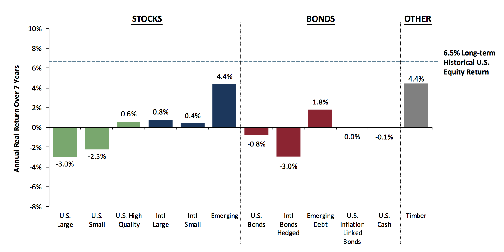

```{r global_options, include=FALSE}
knitr::opts_chunk$set(fig.width=12, fig.height=8, fig.path='Figs/',
                      echo=FALSE, warning=FALSE, message=FALSE)
```

```{r load packages}
library(dplyr)
library(PerformanceAnalytics)
library(ggplot2)
library(ggrepel)
library(scales)
library(googleVis)
```

```{r function: nice performance charts}
cumReturns <- function(x){
  require(dplyr)

  x <- x %>%
    select(date,ticker,value) %>%
    filter(!(is.na(value))) %>%
    mutate(logReturn = log(value + 1)) %>%
    group_by(ticker) %>%
    mutate(cumLogReturn = cumsum(logReturn)) %>%
    mutate(value = exp(cumLogReturn) - 1)
  return(x)
}

nicePlot <- function(x){
  require(ggplot2)
  require(ggrepel)
  plot <- ggplot(x, aes(x = date, y = value, color = ticker)) +
    geom_line() + theme_minimal(base_size = 18) +
     scale_y_continuous(labels = percent) +
    geom_text_repel(
    data = subset(x, date == max(date)),
    aes(label =  ticker),
    size = 6,
    segment.color = NA
  ) + theme(legend.position = "none")
  return(plot)
}

```

```{r load data}
library(dplyr)
my_data <- readRDS('my_data.RDS')

```

```{r define portfolios and strategies}
familias <- c('TOTAL T+ L','Alfa Total','BETA', 'TESORERIA')
hedge_fund <- c('FUTUROS ADMINISTRADOS', "VIX + STRANGLES")
mercado <- c('MACROMODEL', 'PRIMAS DE MERCADO')
```

### Valuaciones a comienzo del año
Los retornos reales esperados a 7 años por clase de activo eran las siguientes.



### Valuaciones a fin del año
Los retornos reales esperados a 7 años por clase de activo eran las siguientes.




```{r}
library(googleVis)
op <- options(gvis.plot.tag='chart')


```


## Resultado del portafolio
(todos los datos son a fines de Noviembre)


El retorno del portafolio en el año 2016 es de -1.7%, y el retorno acumulado desde 2014 es de +9%. A continuación la tabla con los rendimientos mensuales.


```{r pnl overview, fig.height= 6}
library(PerformanceAnalytics)
curr_returns <- my_data$benchmarks %>% filter(ticker == "Portafolio Total") %>% select(date,value)
curr_returns <- xts(curr_returns$value,curr_returns$date)
names(curr_returns) <- 'Portafolio'
knitr::kable(table.CalendarReturns(curr_returns['2014::']))
```

Este es el  retorno mes a mes, comparado contra el benchmark y la inflación.


```{r curvas de equity versus benchmark desde 2014}
chart_tickers <- c("Portafolio Total","Indice de 5 Activos Ajustado","Inflacion USA")

chartSeries <- my_data$benchmarks %>%
             filter(ticker %in%
             chart_tickers) %>%
              filter(date >= '2013-12-31')
  
 cumReturns(chartSeries) %>% nicePlot()
```


Resultado del benchmark

En 2016  el benchmark de  5 índices ajustado por riesgo rindió 2.4%: +10% el S&P 500, +11% Mercados Emergentes, +5% Commodities, +3% Real estate y +1% el Bono del Tesoro Americano. La Tasa libre de riesgo rindió 0%. El benchmark ajustado tiene una xx% de cash - tasa libre de riesgo.


### Detalle del resultado

El portafolio se divide en mercado, hedge fund y  tesorería. Los resultados del 2016 para estos tres portafolios es de  +1.1%, -4.3% y +0.5% respectivamente.

```{r}
portafolio_desc <- read.csv('images/descripciones.csv')
knitr::kable(portafolio_desc)
```

### Apalancamiento y Margen

```{r results='asis', tidy=TRUE}

calendar_plot <- my_data$metricas %>% filter(NombreFamilia == 'TOTAL T+ L') %>%
  select(Fecha,Leverage_Ratio) %>% 
  mutate(Leverage_Ratio = round(Leverage_Ratio,2))

cl2 <- gvisCalendar(calendar_plot %>% filter( Fecha >'2015-12-31'),
                    datevar="Fecha", numvar="Leverage_Ratio",
                    options = list (width = 1000, height = 180,
                                    title ='Leverage del Portfolio'))
plot(cl2)
```

```{r results='asis', tidy=TRUE}

calendar_plot <- my_data$metricas %>% filter(NombreFamilia == 'TOTAL T+ L') %>%
  select(Fecha,Margen_Over_Equity_Ratio) %>% 
  mutate(Margen = round(Margen_Over_Equity_Ratio * 100,2))

cl2 <- gvisCalendar(calendar_plot %>% filter( Fecha >'2015-12-31'),
                    datevar="Fecha", numvar="Margen",
                    options = list (width = 1000, height = 180,
                                    title ='Margen del Portfolio'))
plot(cl2)
```


```{r tabla de detalle de portafolio}
tabla <- data.frame(
  Resultado_2016 = c(1.1,-4.3,0.5,-1.7),
  Capital_Asignado_2016 = c(161,215,154,370)
)
row.names(tabla) <- c('Mercado','Hedge Fund', 'Tesorería', 'Total')
knitr::kable(tabla)

```


```{r detalle por estrategia}

chart_tickers <- c("Macromodel Bruto","Portafolio Alfa",
                   "Tesoreria", 'Portafolio Total')
chartSeries <- my_data$benchmarks %>%
             filter(ticker %in%
             chart_tickers) %>%
              filter(date >= '2013-12-31') %>%
              mutate(ticker = as.factor(ticker))
levels(chartSeries$ticker) <- c('Mercado','Hedge Fund','Total','Tesoreria')

  
 cumReturns(chartSeries) %>% nicePlot()
```

A su vez, el hedge fund tiene 2 sistemas: futuros administrados y venta de volatilidad.

```{r detalle por sistema de hedge fund}

chart_tickers <- c("Fut. Administrados (Neto)","Portafolio Alfa",
                   "Volatilidad (Neto)")

chartSeries <- my_data$benchmarks %>%
             filter(ticker %in%
             chart_tickers) %>%
              filter(date >= '2013-12-31') %>%
              mutate(ticker = as.factor(ticker))
levels(chartSeries$ticker) <- c('Futuros Administrados',
                                'Hedge Fund', 'Venta de Volatilidad')

  
 cumReturns(chartSeries) %>% nicePlot()
```


Los comparables del hedge fund tuvieron estos resultados:

```{r detalle por sistema de benchmark de hedge fund}

chart_tickers <- c( "Benchmark Volatilidad","Benchmark Alfa",
                   "Indice de Futuros Administrados","Portafolio Alfa 3ros")
chartSeries <- my_data$benchmarks %>%
             filter(ticker %in%
             chart_tickers) %>%
              filter(date >= '2013-12-31') %>%
              mutate(ticker = as.factor(ticker))
levels(chartSeries$ticker) <- c('Hedge Fund (bmk)',
                                'Volatilidad (bmk)',
                                'Futuros Administrados (bmk)',
                                'Hedge Fund 3ros')

  
 cumReturns(chartSeries) %>% nicePlot()
```

## Perfil de riesgo del portafolio
```{r}
roro <- my_data$roro  %>%
  group_by(Periodo,`Risk.Type`) %>%
  summarise(Riesgo = sum(value)) %>%
  ungroup()
  
names(roro) <- c('fecha','Perfil','value')
roro$Perfil <- as.factor(roro$Perfil)
levels(roro$Perfil) <- c('Neutral','Conservador','Pro Mercado')
  
 ggplot(roro, aes(x = fecha, y = value, fill = Perfil)) +
   geom_area( position = 'fill', alpha = 0.8) + theme_minimal(base_size = 18)
  
```


## Rentabilidad del portafolio, acumulado del año


```{r results='asis', tidy=TRUE}
library(googleVis)
library(RcppRoll)

curr_strat <- familias[1]

# calendar heatmap pnl diario
calendar_plot <- my_data$pnl %>% filter(NombreFamilia == curr_strat) %>%
  select(Fecha,RentDiaria) %>% 
  filter( Fecha >'2015-12-31') %>%
  mutate(RentDiaria = round(RentDiaria / 1000000,2)) %>%
  mutate(RentDiaria = cumsum(RentDiaria))

cl1 <- gvisCalendar(calendar_plot,
                    datevar="Fecha", numvar="RentDiaria",
                    options = list (width = 1000, height = 180,
                    title = 'Portafolio'))
plot(cl1)
```  

```{r results='asis', tidy=TRUE}
library(googleVis)
library(RcppRoll)

curr_strat <- familias[3]

# calendar heatmap pnl diario
calendar_plot <- my_data$pnl %>% filter(NombreFamilia == curr_strat) %>%
  select(Fecha,RentDiaria) %>% 
  filter( Fecha >'2015-12-31') %>%
  mutate(RentDiaria = round(RentDiaria / 1000000,2)) %>%
  mutate(RentDiaria = cumsum(RentDiaria))

cl1 <- gvisCalendar(calendar_plot,
                    datevar="Fecha", numvar="RentDiaria",
                    options = list (width = 1000, height = 180,
                    title = 'Mercado'))
plot(cl1)
```  

```{r results='asis', tidy=TRUE}
library(googleVis)
library(RcppRoll)

curr_strat <- familias[4]

# calendar heatmap pnl diario
calendar_plot <- my_data$pnl %>% filter(NombreFamilia == curr_strat) %>%
  select(Fecha,RentDiaria) %>% 
  filter( Fecha >'2015-12-31') %>%
  mutate(RentDiaria = round(RentDiaria / 1000000,2)) %>%
  mutate(RentDiaria = cumsum(RentDiaria))

cl1 <- gvisCalendar(calendar_plot,
                    datevar="Fecha", numvar="RentDiaria",
                    options = list (width = 1000, height = 180,
                    title = 'Tesorería'))
plot(cl1)
```  

```{r results='asis', tidy=TRUE}
library(googleVis)
library(RcppRoll)

curr_strat <- familias[2]

# calendar heatmap pnl diario
calendar_plot <- my_data$pnl %>% filter(NombreFamilia == curr_strat) %>%
  select(Fecha,RentDiaria) %>% 
  filter( Fecha >'2015-12-31') %>%
  mutate(RentDiaria = round(RentDiaria / 1000000,2)) %>%
  mutate(RentDiaria = cumsum(RentDiaria))

cl1 <- gvisCalendar(calendar_plot,
                    datevar="Fecha", numvar="RentDiaria",
                    options = list (width = 1000, height = 180,
                    title = 'Hedge Fund'))
plot(cl1)
```  


```{r results='asis', tidy=TRUE}
library(googleVis)
library(RcppRoll)

curr_strat <- hedge_fund[1]

# calendar heatmap pnl diario
calendar_plot <- my_data$pnl %>% filter(NombreFamilia == curr_strat) %>%
  select(Fecha,RentDiaria) %>% 
  filter( Fecha >'2015-12-31') %>%
  mutate(RentDiaria = round(RentDiaria / 1000000,2)) %>%
  mutate(RentDiaria = cumsum(RentDiaria))

cl1 <- gvisCalendar(calendar_plot,
                    datevar="Fecha", numvar="RentDiaria",
                    options = list (width = 1000, height = 180,
                                    title = 'Futuros Administrados'))
plot(cl1)
``` 

```{r results='asis', tidy=TRUE}
library(googleVis)
library(RcppRoll)

curr_strat <- hedge_fund[2]

# calendar heatmap pnl diario
calendar_plot <- my_data$pnl %>% filter(NombreFamilia == curr_strat) %>%
  select(Fecha,RentDiaria) %>% 
  filter( Fecha >'2015-12-31') %>%
  mutate(RentDiaria = round(RentDiaria / 1000000,2)) %>%
  mutate(RentDiaria = cumsum(RentDiaria))

cl1 <- gvisCalendar(calendar_plot,
                    datevar="Fecha", numvar="RentDiaria",
                    options = list (width = 1000, height = 180,
                                    title = 'Volatilidad'))
plot(cl1)
``` 


```{r results='asis', tidy=TRUE}
library(googleVis)
library(RcppRoll)

asset_classes <- unique(my_data$bulk$AT13)
remove_classes <- c("Money Markets",
                    "Cash",
                    "Settlements & Others",
                    "Managed Futures",
                    "Commodities",
                    "N/A",
                    "Trend Following",
                    "")
asset_classes <- asset_classes[!(asset_classes %in% remove_classes)]
bulk_asset_classes <- my_data$bulk %>% select(Periodo,AT13,Resultado) %>%
  filter(Periodo >'2015-12-31') %>%
  group_by(Periodo,AT13) %>%
  summarise(RentDiaria = sum(Resultado)) %>%
  group_by(AT13) %>%
  mutate(RentDiaria = cumsum(RentDiaria))

bulk_roro_assets <- my_data$roro %>%
  filter(Periodo >'2015-12-31') %>%
  mutate(risk_direction = ifelse(`Risk.Type` == 'Risk On',1,-1)) %>%
  mutate(value = value * risk_direction) %>%
  group_by(Periodo,AT13) %>%
  summarise(roro = sum(value))


for(i in 1:length(asset_classes)){

curr_strat <- asset_classes[i]

# calendar heatmap pnl diario
calendar_plot <- bulk_asset_classes %>% filter(AT13 == curr_strat) %>%
  select(Periodo,RentDiaria) %>% 
  filter( Periodo >'2015-12-31') %>%
  mutate(RentDiaria = round(RentDiaria / 1000000,2))


cl1 <- gvisCalendar(calendar_plot,
                    datevar="Periodo", numvar="RentDiaria",
                    options = list (width = 1000, height = 180,
                                    title = paste(curr_strat,'PNL')))
plot(cl1)

calendar_plot <- bulk_roro_assets %>% filter(AT13 == curr_strat) %>%
  select(Periodo,roro) %>% 
  filter( Periodo >'2015-12-31') %>%
  mutate(risk = round(roro / 1000000,2)) %>%
  mutate(risk = cumsum(risk))

cl1 <- gvisCalendar(calendar_plot,
                    datevar="Periodo", numvar="risk",
                    options = list (width = 1000, height = 200,
                                    title = paste(curr_strat,'Riesgo')))
plot(cl1)

}
```  

